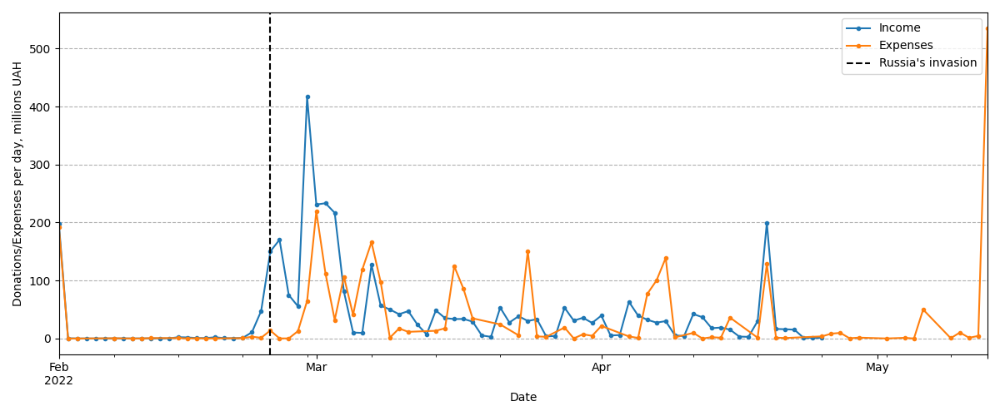
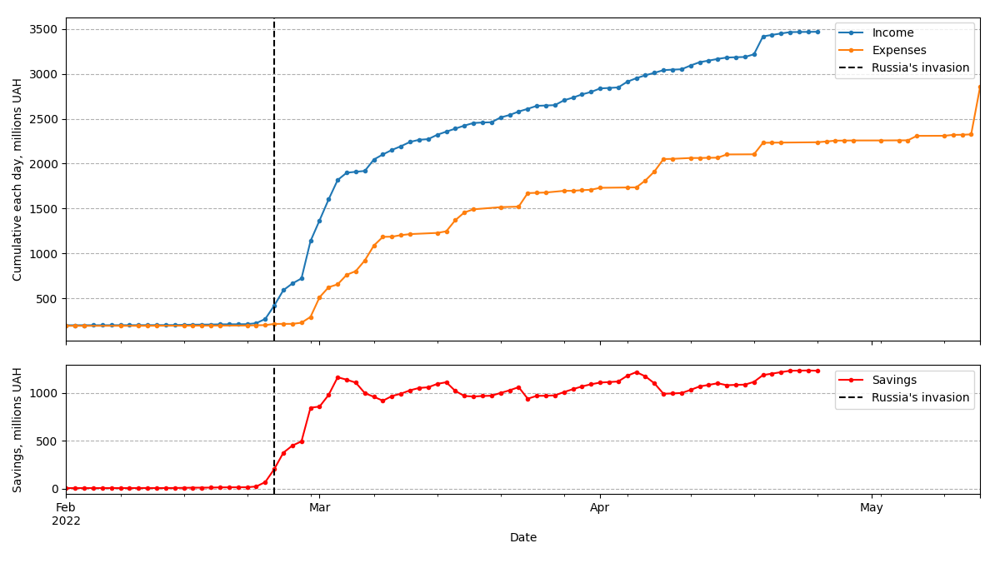

# Statistics of "Come back alive"

Please donate to the Ukrainian army at https://www.comebackalive.in.ua/

## History of donations and expenses

_Daily total donations since February 2022._
_Note large increase in the donations (orange line) after the start of the war on 24 Febraury 2022._
_Note reduction of donations with the time going :(_ 

_Total accumulated donations (orange) and expenses (blue) as well as the reserve (red)._

## Largest donations

|    | date       |   amount, millions UAH | source                                                                                      |
|----|------------|------------------------|---------------------------------------------------------------------------------------------|
|  0 | 2022-04-19 |                  88.94 | ДП ДГЗП "Спецтехноекспорт"                                                                  |
|  1 | 2022-04-19 |                  88.22 | ДП ДГЗП "Спецтехноекспорт"                                                                  |
|  2 | 2022-03-01 |                  85.47 | Недоговірні платежі (Монобанк)                                                              |
|  3 | 2022-03-02 |                  66.90 | Благодійна допомога війсковослужбовцям  ТОВ "ФК "ЄДИНИЙ ПРОСТІР"                            |
|  4 | 2022-02-28 |                  54.15 | Недоговірні платежі (Монобанк) Приняті платежі згідно реєстру №__povernuczhivum_v.csv       |
|  5 | 2022-03-02 |                  40.49 | Приняті платежі згідно реєстру №314106332_20220302_povernuczhivum_20220301v1.csv (Монобанк) |
|  6 | 2022-02-28 |                  27.82 | Недоговірні платежі (Монобанк) Приняті платежі згідно реєстру №__povernuczhivum_v.csv       |
|  7 | 2022-02-25 |                  24.17 | Недоговірні платежі (Монобанк)                                                              |
|  8 | 2022-02-28 |                  21.22 | Недоговірні платежі (Монобанк) Приняті платежі згідно реєстру №__povernuczhivum_v.csv       |
|  9 | 2022-03-07 |                  20.10 | ТОВ "ФК "ЄДИНИЙ ПРОСТІР"                                                                    |
| 10 | 2022-03-03 |                  18.82 | Недоговірні платежі (Монобанк) Приняті платежі згідно реєстру №__povernuczhivum_vcsv        |
| 11 | 2022-03-03 |                  18.82 | Недоговірні платежі (Монобанк) Приняті платежі згідно реєстру №__povernuczhivum_vcsv        |
| 12 | 2022-03-03 |                  16.35 | ТОВ "ФК "ЄДИНИЙ ПРОСТІР" Благодійна допомога війсковослужбовцям                             |
| 13 | 2022-03-03 |                  16.35 | ТОВ "ФК "ЄДИНИЙ ПРОСТІР" Благодійна допомога війсковослужбовцям                             |
| 14 | 2022-02-25 |                  15.00 | ТОВ ЕРУ ТРЕЙДІНГ                                                                            |
| 15 | 2022-03-04 |                  14.91 | Недоговірні платежі (Монобанк) Приняті платежі згідно реєстру №__povernuczhivum_vcsv        |
| 16 | 2022-03-08 |                  12.27 | Приняті платежі згідно реєстру №314994018_20220309_povernuczhivum_20220304v1.csv            |
| 17 | 2022-03-21 |                  11.85 | ТОВ "ФК "ЄДИНИЙ ПРОСТІР"                                                                    |
| 18 | 2022-03-04 |                  10.60 | ТОВ "ФК "ЄДИНИЙ ПРОСТІР" Благодійна допомога війсковослужбовцям                             |
| 19 | 2022-03-24 |                  10.33 | Монобанк, платежі згідно реєстру №319378437_20220324                                        |

<small>Generated on 2022/09/02 20:31:45.</small>

