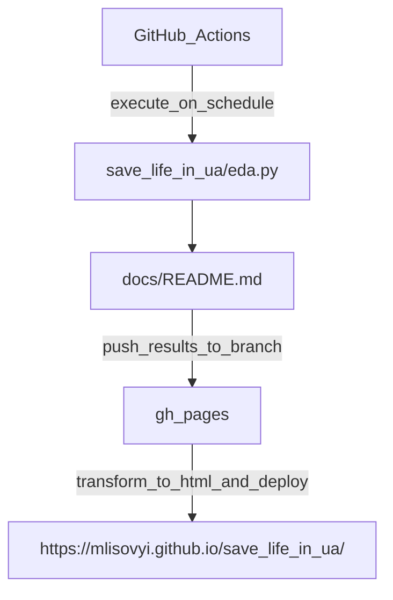

# save_life_in_ua
EDA of the donations and expenses to "Повернись Живим" ("Come back alive"/"Save life in ua"):
<https://www.comebackalive.in.ua/>

The main analysis is in the `save_life_in_ua/eda.py` script.

## Analysis results

The main analysis is scheduled to run regularly in the CI/CD pipeline.
As outcome the markdown `docs/README.md` file is updated and the updated version
is pushed to the `gh-pages` branches, which in turn is served as GitHub pages at
<https://mlisovyi.github.io/save_life_in_ua/>.



As a result of this automation, the user has access to up-to-date information
without needing to have a python, environment and the analysis repository installed.

### Installation

Clone the repository from GitHub:

```bash
git clone https://github.com/mlisovyi/save_life_in_ua.git
```

For execution one has to install relevant python dependencies using `pip`:

```bash
pip install -r requirements/requirements_app.txt
```

The code has been checked to run and is tests in CI/CD using **python 3.8**.
It is strongly recommended to use some virtual environment with dedicated python installation,
e.g. `conda`, `poetry`, `pipenv`, etc.
